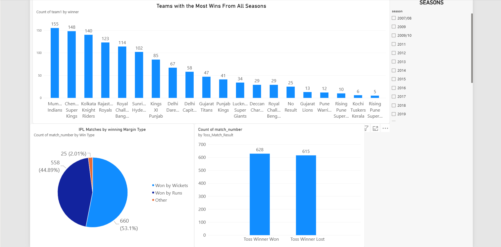
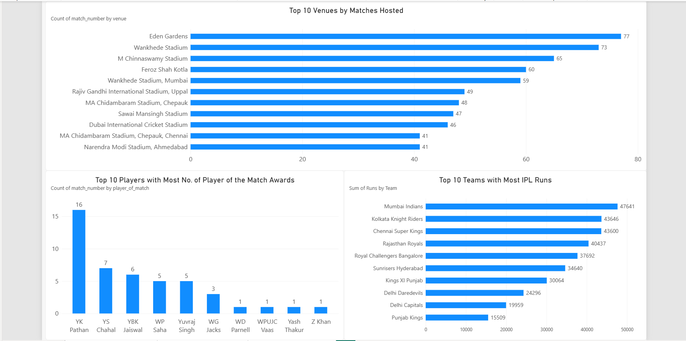
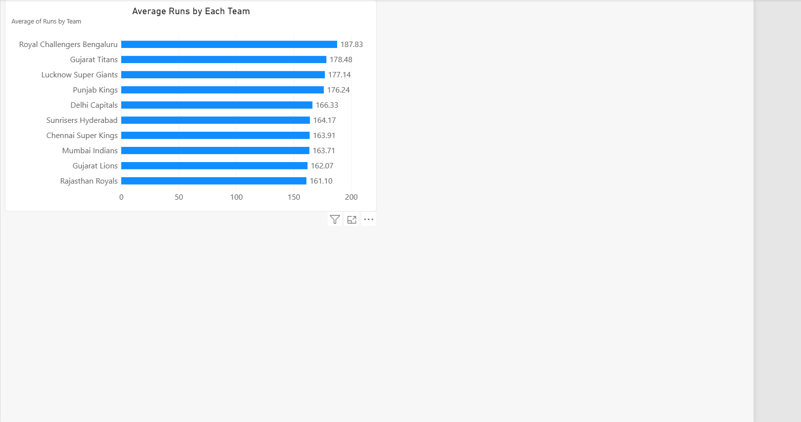

# 🏏 IPL Performance Analysis Dashboard — Power BI

## 📌 Project Overview

This project focuses on analyzing **Indian Premier League (IPL) match data** using **Microsoft Power BI** to identify team performance, match outcomes, toss impact, venue trends, player achievements, and batting performance.

The project was approached from a **business-question perspective**, where different analytical questions were answered using data preparation, transformation, calculations, and interactive visualizations.

The final report consists of **3 Power BI dashboard pages** containing multiple analyses and insights.

---

## 🎯 Project Objectives

The main objectives of this project were to:

* Analyze team performance across IPL seasons.
* Identify teams with the highest number of match wins.
* Understand winning patterns by runs and wickets.
* Analyze the impact of the toss on match outcomes.
* Identify venues that hosted the most IPL matches.
* Analyze Player of the Match awards.
* Compare total runs scored by IPL teams.
* Analyze average runs scored per match by teams.
* Convert raw match data into meaningful business insights using Power BI.

---

## 📊 Business Questions Analyzed

### 1. Which IPL teams have won the most matches?

Analyzed the total number of matches won by each team to understand overall team success in the available dataset.

### 2. Which team has won the most matches in each IPL season?

Used season-level analysis to identify the team with the highest number of wins in individual IPL seasons.

### 3. Are teams more frequently winning by runs or wickets?

Created a **Win Type** classification based on the winning margin:

* Won by Runs
* Won by Wickets
* Other

This helped compare the frequency of different winning methods.

### 4. What do teams choose after winning the toss, and how often does the toss winner also win?

Analyzed:

* Toss decision — Bat or Field
* Toss Winner vs Match Winner

This provides an understanding of toss decisions and their relationship with match outcomes.

### 5. Which venues have hosted the most IPL matches?

Analyzed the number of matches played at different venues and identified the venues with the highest match counts.

### 6. Which players have received the most Player of the Match awards?

Analyzed Player of the Match records to identify players who were recognized most frequently in the dataset.

### 7. Which teams have scored the most total runs?

The dataset contained separate run columns for Team 1 and Team 2.

To analyze team-level batting performance correctly, the data was transformed into a normalized structure containing:

```text
Team | Runs
```

The Team 1 and Team 2 data was then combined using **Power Query** to calculate total runs for each team.

### 8. Which IPL teams have the highest average runs per match?

Calculated the average runs scored by each team across its matches to compare batting performance.

---

## 🔍 Key Insights

Some of the key findings from the analysis include:

* **Mumbai Indians** recorded the highest total runs in the dataset with **47,641 runs**.
* **Royal Challengers Bengaluru** recorded the highest average runs per match at approximately **187.83 runs**.
* Winning by **wickets** occurred more frequently than winning by runs.
* Teams selected **Field** more frequently than **Bat** after winning the toss.
* **Mumbai Indians** recorded the highest number of match wins in the dataset, followed by **Chennai Super Kings** and **Kolkata Knight Riders**.
* **Eden Gardens** was among the venues with the highest number of matches hosted.
* **YK Pathan** recorded the highest number of Player of the Match awards in the analyzed dataset.

> These insights are based on the available dataset and should not be interpreted as complete historical IPL records outside the dataset.

---

## 🛠️ Tools & Technologies

* **Microsoft Power BI**
* **Power Query**
* **DAX**
* **Data Cleaning**
* **Data Transformation**
* **Data Analysis**
* **Data Visualization**

---

## 🔄 Data Preparation & Transformation

Power Query was used to prepare the dataset for analysis.

Key transformation steps included:

1. Loading the IPL match dataset into Power BI.
2. Reviewing the available columns and data types.
3. Preparing the data for visualization.
4. Creating calculated columns for match outcome analysis.
5. Creating a **Win Type** classification.
6. Creating a **Toss Match Result** classification.
7. Separating Team 1 and Team 2 run information.
8. Appending the two team-run datasets into a single table.
9. Using aggregations such as **Count, Sum, and Average** for analysis.
10. Building interactive Power BI visuals.

---

## 📈 Dashboard Pages

The final Power BI report contains **3 analytical pages**.

### Page 1 — Team & Match Performance

Includes analysis related to:

* Team wins
* Season-wise performance
* Winning margin
* Toss decisions
* Toss impact

### Page 2 — Venue & Player Analysis

Includes:

* Top IPL venues by matches hosted
* Player of the Match analysis
* Other match-level performance insights

### Page 3 — Batting Performance

Includes:

* Total runs by team
* Average runs per match
* Team batting performance comparison

---

## 📊 Dashboard Preview

### Page 1



### Page 2



### Page 3



## 📁 Project Structure

```text
IPL-PowerBI-Analysis/
│
├── Dashboard/
│   ├── Page_1.png
│   ├── Page_2.png
│   └── Page_3.png
│
├── Dataset/
│   └── IPL_Matches_Data.csv
│
├── Documentation/
│   └── README.md
│
└── PowerBI/
    └── IPL_Analysis.pbix
```

---

## 💡 Skills Demonstrated

Through this project, I practiced:

* Data Cleaning
* Data Transformation
* Power Query
* DAX Calculated Columns
* Aggregation
* Grouping
* Data Modeling
* Data Visualization
* Business Question Analysis
* Dashboard Development
* Sports Analytics

---

## 🚀 Future Improvements

Possible future enhancements include:

* Player-level batting and bowling analysis.
* Venue-wise team performance.
* Toss decision vs win percentage.
* Powerplay and death-over analysis.
* Team performance by season.
* Player comparison dashboards.
* Interactive team and player filters.
* Advanced cricket analytics using Python and SQL.

---

## 👨‍💻 Author

**Rakada Rupesh Nagireddy**

B.Tech — Electrical & Electronics Engineering
Aspiring Data Analyst | Power BI | SQL | Excel | Python

### 🔗 Connect With Me

* LinkedIn: [Rakada Rupesh](https://www.linkedin.com/in/rakada-rupesh/)
* GitHub: [Rupesh-29](https://github.com/Rupesh-29)

---

## ⭐ If you found this project useful

Feel free to explore the dashboard, dataset, and Power BI file to understand the analysis and transformations performed in this project.
